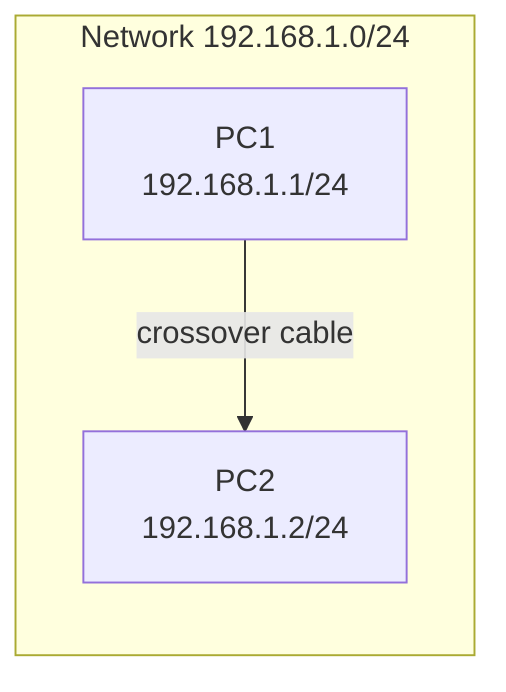

# **Project 1: The Very Basics - Connecting Two PCs**

**Time Estimate:** 15 minutes | **Difficulty:** Beginner | **Status:** Tested ✓ | **Last Updated:** 2025-10-5

## **Table of Contents**
- [Objective](#objective)
- [Quick Start](#quick-start)
- [Topology & Design](#topology--design)
- [Configuration](#configuration)
- [Verification](#verification)
- [Troubleshooting](#troubleshooting)
- [Protocol Deep Dive](#protocol-deep-dive)
- [Skills Demonstrated](#skills-demonstrated)
- [Real-World Applications](#real-world-applications)
- [Learning Outcomes](#learning-outcomes)

## **Objective**
> Establish direct communication between two computers using IP addressing, demonstrating fundamental network connectivity principles.

**Key Goals:**
- [ ] Configure static IP addresses on two PCs
- [ ] Establish physical connectivity
- [ ] Verify communication using ping
- [ ] Understand basic troubleshooting

## **Quick Start**
### **Prerequisites**
- Basic computer literacy
- Packet Tracer installed
- Understanding of IP addresses

### **Implementation Checklist**
- [ ] Connect two PCs with cable (5 minutes)
- [ ] Configure IP addresses (5 minutes)
- [ ] Test connectivity with ping (5 minutes)

### **Time Breakdown**
| Phase | Time | Focus |
|-------|------|-------|
| Setup | 5 min | Physical connections |
| Configuration | 5 min | IP addressing |
| Verification | 5 min | Connectivity testing |

## **Topology & Design**


### **Network Design Table**
| Component | Specification | Purpose |
|-----------|---------------|---------|
| Network | 192.168.1.0/24 | Direct communication |
| PC1 IP | 192.168.1.1/24 | First endpoint |
| PC2 IP | 192.168.1.2/24 | Second endpoint |

### **The WHY**
- **Why static IPs?** Simplest method for point-to-point communication
- **Why /24 subnet?** Provides same network for direct communication
- **Why crossover cable?** Modern devices use auto-MDI/X, but conceptually important

## **Configuration**

### **PC Configurations**
```bash
# PC1 Configuration
IP Address: 192.168.1.1
Subnet Mask: 255.255.255.0
Default Gateway: [Leave blank]

# PC2 Configuration  
IP Address: 192.168.1.2
Subnet Mask: 255.255.255.0
Default Gateway: [Leave blank]
```

### **The WHY**
- **Why no gateway?** Direct communication doesn't require routing
- **Why specific IP range?** Using private IP space (192.168.x.x)
- **Why /24 mask?** Ensures both IPs are in the same broadcast domain

## **Verification**

### **Expected Results**
```bash
# Successful ping output:
C:\> ping 192.168.1.2

Pinging 192.168.1.2 with 32 bytes of data:
Reply from 192.168.1.2: bytes=32 time<1ms TTL=128
Reply from 192.168.1.2: bytes=32 time<1ms TTL=128
Reply from 192.168.1.2: bytes=32 time<1ms TTL=128
Reply from 192.168.1.2: bytes=32 time<1ms TTL=128

Ping statistics for 192.168.1.2:
    Packets: Sent = 4, Received = 4, Lost = 0 (0% loss)
```

### **Verification Steps**
1. **Step 1:** `ping 192.168.1.2` from PC1
2. **Step 2:** `ping 192.168.1.1` from PC2
3. **Step 3:** Verify 0% packet loss in both directions

### **The WHY**
- **Why bidirectional ping?** Confirms connectivity works both ways
- **Why check packet loss?** Indicates stable connection
- **Why TTL=128?** Windows default TTL, confirms OS fingerprint

## **Troubleshooting**

### **Common Issues & Solutions**
| Symptom | Possible Cause | Solution |
|---------|---------------|----------|
| "Destination host unreachable" | Wrong subnet mask | Verify both PCs use 255.255.255.0 |
| "Request timed out" | Cable not connected | Check physical connection |
| "General failure" | NIC disabled | Enable network interface |
| IP conflict | Duplicate IP addresses | Use unique IPs for each PC |

### **Debug Commands**
```bash
# Windows IP verification:
ipconfig /all
ping 127.0.0.1 (loopback test)

# Clear ARP cache if needed:
arp -d *
```

## **Protocol Deep Dive**

### **ICMP & ARP Operation**


### **Key Concepts**
- **ARP Protocol:** Resolves IP addresses to MAC addresses
- **ICMP Protocol:** Internet Control Message Protocol for testing
- **Broadcast Domain:** Devices that receive each other's broadcasts

### **Packet Analysis**
> Use Packet Tracer Simulation mode to observe ARP requests and ICMP packets

## **Skills Demonstrated**
- ✅ **IP Addressing** - Configuring static IP addresses correctly
- ✅ **Physical Connectivity** - Understanding cable requirements
- ✅ **Basic Troubleshooting** - Using ping for connectivity testing
- ✅ **Subnet Comprehension** - Understanding network boundaries

## **Real-World Applications**

### **Direct Device Connections**
- **Point-to-point links** between servers
- **Maintenance connections** for network devices
- **Temporary networks** for data transfer
- **Embedded systems** communication

### **Business Value**
- **Foundation building** for all network communication
- **Troubleshooting skills** applicable to complex networks
- **Conceptual understanding** of layered network model

## **Learning Outcomes**
By completing this lab, you will understand:

### **Technical Knowledge**
- How devices communicate at layer 2 and 3
- The role of ARP in IP communication
- ICMP protocol operation for network testing

### **Practical Skills**
- Configuring basic network interfaces
- Using ping for connectivity verification
- Troubleshooting simple network issues
- Understanding physical vs logical connectivity

---

**Maintained by:** Rick's Home Lab
*Part of the CCNA Fundamentals Series*
