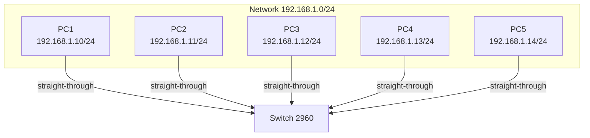
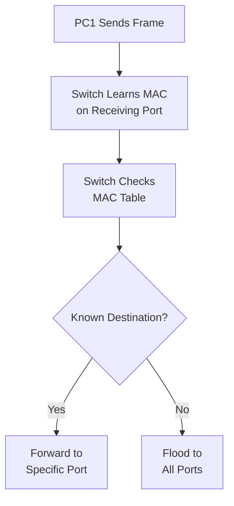

# **Project 2: Building a Small LAN with a Switch**

**Time Estimate:** 25 minutes | **Difficulty:** Beginner | **Status:** Tested ✓ | **Last Updated:** 2025-10-5

## **Table of Contents**
- [Objective](#objective)
- [Quick Start](#quick-start)
- [Topology & Design](#topology--design)
- [Configuration](#configuration)
- [Verification](#verification)
- [Troubleshooting](#troubleshooting)
- [Protocol Deep Dive](#protocol-deep-dive)
- [Skills Demonstrated](#skills-demonstrated)
- [Real-World Applications](#real-world-applications)
- [Learning Outcomes](#learning-outcomes)

## **Objective**
> Create a functional Local Area Network (LAN) using a switch to enable seamless communication between multiple devices, demonstrating fundamental switching concepts and MAC address learning.

**Key Goals:**
- [ ] Connect multiple devices through a single switch
- [ ] Configure IP addressing for same subnet communication
- [ ] Verify layer 2 switching operations
- [ ] Understand MAC address learning and frame forwarding

## **Quick Start**
### **Prerequisites**
- Completion of Project 1 (Two PC direct connection)
- Understanding of IP addressing basics
- Packet Tracer with 2960 switch

### **Implementation Checklist**
- [ ] Connect 4-5 PCs to switch (5 minutes)
- [ ] Configure IP addresses (10 minutes)
- [ ] Test full mesh connectivity (5 minutes)
- [ ] Verify switching operations (5 minutes)

### **Time Breakdown**
| Phase | Time | Focus |
|-------|------|-------|
| Physical Setup | 5 min | Cable connections |
| Logical Config | 10 min | IP addressing |
| Verification | 10 min | Testing & analysis |

## **Topology & Design**


### **Network Design Table**
| Component | Specification | Purpose |
|-----------|---------------|---------|
| Network | 192.168.1.0/24 | Single broadcast domain |
| Switch | Cisco 2960 | Layer 2 frame forwarding |
| IP Range | 192.168.1.10-14 | Sequential addressing |

### **The WHY**
- **Why a switch?** Creates a single broadcast domain with individual collision domains
- **Why sequential IPs?** Easy management and troubleshooting
- **Why /24 subnet?** Standard LAN configuration with 254 usable hosts

## **Configuration**

### **PC Configurations**
```bash
# Sequential IP Addressing Scheme
PC1: 192.168.1.10/24
PC2: 192.168.1.11/24  
PC3: 192.168.1.12/24
PC4: 192.168.1.13/24
PC5: 192.168.1.14/24

# No default gateway needed - same subnet communication
```

### **Switch Configuration**
```bash
# Basic switch verification (managed switch)
Switch> enable
Switch# show mac-address-table
Switch# show interfaces status
```

### **The WHY**
- **Why no switch config?** Unmanaged switches work out-of-box; managed switches show learning process
- **Why sequential IPs?** Demonstrates organized IP address management
- **Why no gateway?** All communication stays within same layer 2 domain

## **Verification**

### **Expected Results**
```bash
# Successful ping between all devices:
C:\> ping 192.168.1.11
Reply from 192.168.1.11: bytes=32 time<1ms TTL=128

# ARP table shows learned neighbors:
C:\> arp -a
Interface: 192.168.1.10
  192.168.1.11    00-50-56-01-01-01     dynamic
  192.168.1.12    00-50-56-01-01-02     dynamic

# Switch MAC address table:
Switch# show mac-address-table
          Mac Address Table
-------------------------------------------
Vlan    Mac Address       Type        Ports
----    -----------       --------    -----
 1      0050.5601.0101    DYNAMIC     Fa0/1
 1      0050.5601.0102    DYNAMIC     Fa0/2
 1      0050.5601.0103    DYNAMIC     Fa0/3
```

### **Verification Steps**
1. **Connectivity Test:** Ping from each PC to all other PCs
2. **ARP Validation:** Check `arp -a` on each PC for learned neighbors
3. **Switch Learning:** Verify `show mac-address-table` shows all connected devices
4. **Port Status:** Confirm all switch interfaces show "connected"

### **The WHY**
- **Why full mesh ping?** Verifies any-to-any communication capability
- **Why check ARP tables?** Confirms layer 2 to layer 3 address resolution
- **Why examine MAC table?** Demonstrates switch learning process

## **Troubleshooting**

### **Common Issues & Solutions**
| Symptom | Possible Cause | Solution |
|---------|---------------|----------|
| Ping fails between some PCs | Wrong subnet mask | Verify all use 255.255.255.0 |
| ARP table empty | No traffic generated | Ping other devices to populate ARP |
| Switch ports down | Cable/interface issues | Check connections, use `show interfaces` |
| MAC table incomplete | Switch learning delay | Generate more traffic between devices |

### **Debug Commands**
```bash
# Switch troubleshooting:
show interfaces
show mac-address-table
show vlan brief

# PC troubleshooting:
ipconfig /all
arp -d * (clear ARP cache)
ping 127.0.0.1 (loopback test)
```

## **Protocol Deep Dive**

### **Switch Learning Process**


### **Key Concepts**
- **MAC Learning:** Switch builds table of MAC-to-port mappings
- **Frame Forwarding:** Unicast to known ports, flood for unknown/broadcast
- **Broadcast Domain:** All devices receive broadcast traffic (ARP requests)
- **Collision Domain:** Each switch port is separate collision domain

### **ARP Process in LAN**
1. **PC1 wants to ping PC2** but only knows IP address
2. **PC1 sends ARP broadcast:** "Who has 192.168.1.11?"
3. **PC2 replies with unicast:** "I have that IP, my MAC is..."
4. **Switch learns both MAC addresses** during this exchange

## **Skills Demonstrated**
- ✅ **LAN Design** - Multi-device network planning and implementation
- ✅ **Switch Operation** - Understanding MAC learning and frame forwarding
- ✅ **IP Management** - Organized subnet addressing scheme
- ✅ **Layer 2 Troubleshooting** - Using ARP and MAC tables for diagnostics
- ✅ **Protocol Analysis** - Understanding ARP and switching processes

## **Real-World Applications**

### **Small Business Networks**
- **Office LANs** - Employee workstations and shared resources
- **Home Networks** - Multiple devices connecting to internet gateway
- **Classroom Labs** - Educational environments with multiple computers
- **Retail POS** - Point-of-sale systems connected to central server

### **Business Value**
- **Scalability** - Foundation for expanding network infrastructure
- **Performance** - Dedicated bandwidth per device via switching
- **Troubleshooting** - Essential skills for network maintenance
- **Design Principles** - Understanding broadcast domains and traffic flow

## **Learning Outcomes**
By completing this lab, you will understand:

### **Technical Knowledge**
- How switches dynamically learn and maintain MAC address tables
- The difference between broadcast and collision domains
- ARP protocol operation within a local subnet
- Frame forwarding decisions in layer 2 switching

### **Practical Skills**
- Designing and implementing functional LAN infrastructure
- Troubleshooting layer 2 connectivity issues
- Analyzing network traffic using ARP and MAC tables
- Configuring multiple devices for seamless communication

### **Foundation Building**
- Prepares for VLAN concepts (separating broadcast domains)
- Understanding for STP (loop prevention in switched networks)
- Basis for layer 3 switching and inter-VLAN routing

---

**Maintained by:** Rick's Home Lab  
*Part of the CCNA Fundamentals Series - Building upon Project 1*

## **Career Connection:**
This lab demonstrates essential networking fundamentals that interviewers expect you to understand. Being able to explain switching concepts and troubleshoot layer 2 issues is crucial for entry-level network positions.
