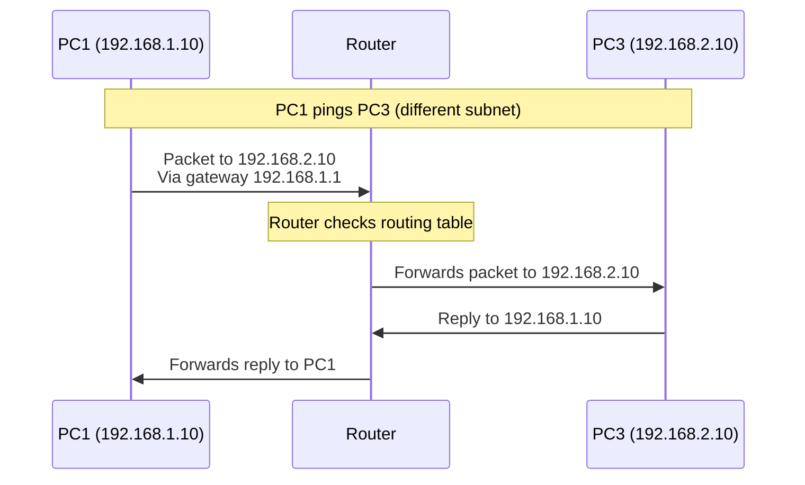

# **Project 3: Basic Router Configuration and Inter-VLAN Routing**

**Time Estimate:** 35 minutes | **Difficulty:** Beginner-Intermediate | **Status:** Tested ✓ | **Last Updated:** 2024-12-19

## **Table of Contents**
- [Objective](#objective)
- [Quick Start](#quick-start)
- [Topology & Design](#topology--design)
- [Configuration](#configuration)
- [Verification](#verification)
- [Troubleshooting](#troubleshooting)
- [Protocol Deep Dive](#protocol-deep-dive)
- [Skills Demonstrated](#skills-demonstrated)
- [Real-World Applications](#real-world-applications)
- [Learning Outcomes](#learning-outcomes)

## **Objective**
> Connect and route traffic between two separate subnets using a router, demonstrating fundamental layer 3 operations and inter-network communication principles.

**Key Goals:**
- [ ] Configure router interfaces for multiple subnets
- [ ] Implement default gateway functionality
- [ ] Establish communication between different networks
- [ ] Understand routing table operations

## **Quick Start**
### **Prerequisites**
- Completion of Projects 1 & 2 (Basic connectivity and switching)
- Understanding of IP addressing and subnetting
- Packet Tracer with router and switch devices

### **Implementation Checklist**
- [ ] Build physical topology (5 minutes)
- [ ] Configure router interfaces (10 minutes)
- [ ] Set up PC IP addresses and gateways (10 minutes)
- [ ] Test inter-network communication (10 minutes)

### **Time Breakdown**
| Phase | Time | Focus |
|-------|------|-------|
| Physical Setup | 5 min | Device connections |
| Router Config | 10 min | Interface addressing |
| End Device Config | 10 min | IP and gateway setup |
| Verification | 10 min | Cross-subnet testing |

## **Topology & Design**
```ascii
    Network A (192.168.1.0/24)          Network B (192.168.2.0/24)
        │                                       │
    [PC1] ─── [Switch1] ─── [Router] ─── [Switch2] ─── [PC3]
    [PC2]    192.168.1.1/24  (G0/0/0)  192.168.2.1/24   [PC4]
              Gateway                   Gateway
```

### **Network Design Table**
| Component | Specification | Purpose |
|-----------|---------------|---------|
| Network A | 192.168.1.0/24 | First subnet/VLAN |
| Network B | 192.168.2.0/24 | Second subnet/VLAN |
| Router G0/0/0 | 192.168.1.1/24 | Network A gateway |
| Router G0/0/1 | 192.168.2.1/24 | Network B gateway |

### **The WHY**
- **Why separate subnets?** Demonstrates routing between broadcast domains
- **Why router as gateway?** Central point for inter-subnet communication
- **Why sequential IPs?** Organized addressing for easy troubleshooting

## **Configuration**

### **Router Configuration**
```bash
Router> enable
Router# configure terminal

! Configure Network A interface
Router(config)# interface gigabitethernet0/0/0
Router(config-if)# description Connection to Network A
Router(config-if)# ip address 192.168.1.1 255.255.255.0
Router(config-if)# no shutdown
Router(config-if)# exit

! Configure Network B interface
Router(config)# interface gigabitethernet0/0/1
Router(config-if)# description Connection to Network B
Router(config-if)# ip address 192.168.2.1 255.255.255.0
Router(config-if)# no shutdown
Router(config-if)# exit

! Save configuration
Router(config)# end
Router# copy running-config startup-config
```

### **PC Configurations**
```bash
# Network A Devices
PC1: 192.168.1.10/24 | Gateway: 192.168.1.1
PC2: 192.168.1.11/24 | Gateway: 192.168.1.1

# Network B Devices  
PC3: 192.168.2.10/24 | Gateway: 192.168.2.1
PC4: 192.168.2.11/24 | Gateway: 192.168.2.1
```

### **The WHY**
- **Why gateway configuration?** Tells hosts how to reach other networks
- **Why interface descriptions?** Professional practice for documentation
- **Why save configuration?** Prevents loss after reboot

## **Verification**

### **Expected Results**
```bash
# Router interface status:
Router# show ip interface brief
Interface              IP-Address      OK? Method Status
GigabitEthernet0/0/0   192.168.1.1     YES manual up
GigabitEthernet0/0/1   192.168.2.1     YES manual up

# Routing table shows connected networks:
Router# show ip route
Codes: C - connected, S - static, I - IGRP, R - RIP...
C    192.168.1.0/24 is directly connected, GigabitEthernet0/0/0
C    192.168.2.0/24 is directly connected, GigabitEthernet0/0/1

# Successful cross-subnet ping:
C:\> ping 192.168.2.10
Reply from 192.168.2.10: bytes=32 time=1ms TTL=127
```

### **Verification Steps**
1. **Router Interfaces:** Verify `show ip interface brief` shows both interfaces UP/UP
2. **Routing Table:** Confirm `show ip route` displays both connected networks
3. **Intra-subnet Test:** Ping within same network (PC1 → PC2)
4. **Inter-subnet Test:** Ping across networks (PC1 → PC3)
5. **Gateway Test:** Ping default gateway from all PCs

### **The WHY**
- **Why check interface status?** Confirms physical and logical layer operation
- **Why examine routing table?** Verifies router knows about connected networks
- **Why test both directions?** Ensures bidirectional routing works

## **Troubleshooting**

### **Common Issues & Solutions**
| Symptom | Possible Cause | Solution |
|---------|---------------|----------|
| Cross-subnet ping fails | Missing default gateway | Configure gateway on PCs |
| Router interfaces down | `no shutdown` missing | Enable interfaces |
| One-way communication | Asymmetric routing | Check both subnets' gateways |
| Interface administratively down | Cable/port issues | Verify physical connections |

### **Debug Commands**
```bash
# Router troubleshooting:
show ip interface brief
show running-config
show interfaces
debug ip packet (use cautiously)

# PC troubleshooting:
ipconfig /all
arp -a
tracert 192.168.2.10 (path verification)
```

## **Protocol Deep Dive**

### **Packet Journey Between Subnets**


### **Key Concepts**
- **Routing Decision:** Router uses routing table to determine next hop
- **Default Gateway:** Hosts send off-subnet traffic to their configured gateway
- **Connected Routes:** Automatically added to routing table when interfaces are configured
- **TTL Decrement:** Router decreases TTL by 1, indicating hop count

### **The Routing Process**
1. **PC1 determines** 192.168.2.10 is on different subnet
2. **PC1 sends packet** to its default gateway (192.168.1.1)
3. **Router receives packet**, checks routing table for 192.168.2.0/24
4. **Router forwards packet** out appropriate interface (G0/0/1)
5. **Process reverses** for reply traffic

## **Skills Demonstrated**
- ✅ **Router Configuration** - Interface setup and basic operations
- ✅ **Multi-subnet Design** - Planning and implementing separate networks
- ✅ **Gateway Implementation** - Configuring default route for hosts
- ✅ **Inter-VLAN Routing** - Connecting separate broadcast domains
- ✅ **Troubleshooting** - Diagnosing layer 3 connectivity issues

## **Real-World Applications**

### **Enterprise Network Segmentation**
- **Department Separation** - HR, Finance, Engineering in different subnets
- **Security Zones** - Isolated networks for different security levels
- **Branch Office Connectivity** - Connecting remote sites to headquarters
- **Multi-tenant Environments** - Separate customers or business units

### **Business Value**
- **Security** - Isolate broadcast domains and control traffic flow
- **Performance** - Reduce broadcast traffic in each subnet
- **Management** - Organized IP addressing and troubleshooting
- **Scalability** - Foundation for complex network designs

## **Learning Outcomes**
By completing this lab, you will understand:

### **Technical Knowledge**
- How routers make forwarding decisions based on IP addresses
- The critical role of default gateways in multi-subnet environments
- Difference between layer 2 (switching) and layer 3 (routing) operations
- Routing table structure and connected routes

### **Practical Skills**
- Configuring Cisco router interfaces for multiple networks
- Implementing and troubleshooting inter-subnet communication
- Using essential router verification commands
- Designing basic routed network topologies

### **Career Foundation**
- **Prepares for:** Dynamic routing protocols (OSPF, EIGRP)
- **Builds toward:** Advanced inter-VLAN routing concepts
- **Essential for:** Network administrator and engineer roles
- **Interview ready:** Common topic in networking interviews

---

**Maintained by:** Rick's Home Lab 
*Part of the CCNA Fundamentals Series - Progressing to Layer 3 Operations*

## **Career Connection:**
This project demonstrates fundamental routing concepts that are essential for any network role. Interviewers frequently ask about default gateway functionality and basic router configuration. Mastering these concepts shows you understand how networks actually communicate beyond simple switching.
