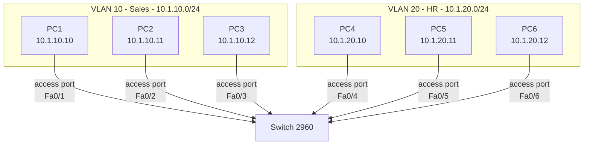
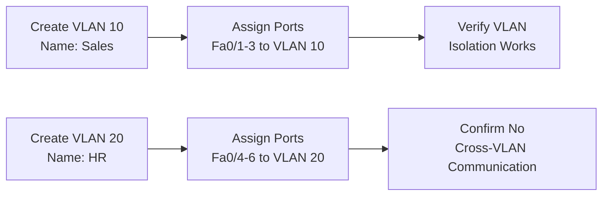
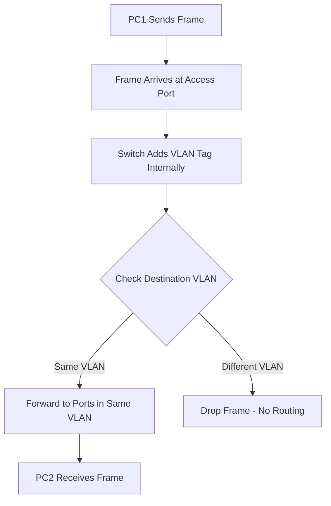

# **Project 4: Basic VLAN Configuration**

**Time Estimate:** 30 minutes | **Difficulty:** Beginner-Intermediate | **Status:** Tested ✓ | **Last Updated:** 2025-10-5

## **Table of Contents**
- [Objective](#objective)
- [Quick Start](#quick-start)
- [Topology & Design](#topology--design)
- [Configuration](#configuration)
- [Verification](#verification)
- [Troubleshooting](#troubleshooting)
- [Protocol Deep Dive](#protocol-deep-dive)
- [Skills Demonstrated](#skills-demonstrated)
- [Real-World Applications](#real-world-applications)
- [Learning Outcomes](#learning-outcomes)

## **Objective**
> Segment a single physical switch into multiple logical networks using VLANs to control broadcast domains and enhance network security through logical isolation.

**Key Goals:**
- [ ] Create and name VLANs for different departments
- [ ] Assign switch ports to specific VLANs
- [ ] Verify intra-VLAN communication works
- [ ] Confirm inter-VLAN communication is blocked
- [ ] Understand broadcast domain separation

## **Quick Start**
### **Prerequisites**
- Completion of Project 2 (Basic switching concepts)
- Understanding of IP addressing and subnets
- Packet Tracer with 2960 switch

### **Implementation Checklist**
- [ ] Create VLANs 10 and 20 (5 minutes)
- [ ] Configure access ports for each VLAN (10 minutes)
- [ ] Set up PC IP addresses (5 minutes)
- [ ] Test VLAN isolation (10 minutes)

### **Time Breakdown**
| Phase | Time | Focus |
|-------|------|-------|
| VLAN Setup | 5 min | Creating and naming VLANs |
| Port Config | 10 min | Assigning ports to VLANs |
| PC Setup | 5 min | IP addressing |
| Verification | 10 min | Testing isolation |

## **Topology & Design**

### **Physical vs Logical View**


### **VLAN Port Assignment Flow**


### **VLAN Design Table**
| VLAN ID | VLAN Name | Ports | IP Subnet | Purpose |
|---------|-----------|-------|-----------|---------|
| 10 | Sales | Fa0/1-3 | 10.1.10.0/24 | Sales Department |
| 20 | HR | Fa0/4-6 | 10.1.20.0/24 | Human Resources |
| 1 | Default | All others | N/A | Default VLAN |

### **The WHY**
- **Why VLANs?** Logical segmentation without additional hardware
- **Why department-based?** Real-world security and organizational needs
- **Why different subnets?** Reinforces logical separation at layer 3
- **Why access ports?** Simple single-VLAN assignment for end devices

## **Configuration**

### **Switch VLAN Configuration**
```bash
Switch> enable
Switch# configure terminal

! Create and name VLANs
Switch(config)# vlan 10
Switch(config-vlan)# name Sales
Switch(config-vlan)# exit

Switch(config)# vlan 20
Switch(config-vlan)# name HR
Switch(config-vlan)# exit

! Configure Sales VLAN ports (1-3)
Switch(config)# interface range fastethernet 0/1-3
Switch(config-if-range)# switchport mode access
Switch(config-if-range)# switchport access vlan 10
Switch(config-if-range)# description Sales Department
Switch(config-if-range)# no shutdown
Switch(config-if-range)# exit

! Configure HR VLAN ports (4-6)
Switch(config)# interface range fastethernet 0/4-6
Switch(config-if-range)# switchport mode access
Switch(config-if-range)# switchport access vlan 20
Switch(config-if-range)# description HR Department
Switch(config-if-range)# no shutdown
Switch(config-if-range)# exit

! Save configuration
Switch(config)# end
Switch# copy running-config startup-config
```

### **PC Configurations**
```bash
# VLAN 10 - Sales Department
PC1: 10.1.10.10/24
PC2: 10.1.10.11/24
PC3: 10.1.10.12/24

# VLAN 20 - HR Department
PC4: 10.1.20.10/24
PC5: 10.1.20.11/24
PC6: 10.1.20.12/24
```

### **The WHY**
- **Why interface range?** Efficient configuration of multiple ports
- **Why access mode?** Ensures ports carry only one VLAN's traffic
- **Why descriptions?** Professional practice for documentation
- **Why save config?** Prevents loss after switch reboot

## **Verification**

### **Expected Results**
```bash
# VLAN database verification:
Switch# show vlan brief

VLAN Name                             Status    Ports
---- -------------------------------- --------- --------------------------
1    default                          active    Fa0/7-24, Gi0/1-2
10   Sales                            active    Fa0/1, Fa0/2, Fa0/3
20   HR                               active    Fa0/4, Fa0/5, Fa0/6

# Successful intra-VLAN ping:
C:\> ping 10.1.10.11
Reply from 10.1.10.11: bytes=32 time<1ms TTL=128

# Failed inter-VLAN ping (expected):
C:\> ping 10.1.20.10
Request timed out.
```

### **Verification Steps**
1. **VLAN Configuration:** `show vlan brief` confirms port assignments
2. **Interface Status:** `show interfaces status` shows VLAN membership
3. **Intra-VLAN Test:** Ping between devices in same VLAN (should work)
4. **Inter-VLAN Test:** Ping between devices in different VLANs (should fail)
5. **MAC Table:** `show mac address-table` shows VLAN-specific learning

### **The WHY**
- **Why check VLAN brief?** Confirms port-to-VLAN assignments are correct
- **Why test both scenarios?** Verifies both connectivity and isolation work
- **Why examine MAC table?** Shows switch learning within each VLAN separately

## **Troubleshooting**

### **Common Issues & Solutions**
| Symptom | Possible Cause | Solution |
|---------|---------------|----------|
| Intra-VLAN ping fails | Port not in correct VLAN | Verify with `show vlan brief` |
| All pings fail | Ports in shutdown state | Check `show interfaces status` |
| Configuration lost | Not saved to startup | Use `copy running-config startup-config` |
| Can ping some but not all | IP address mismatch | Verify all PCs in same subnet for their VLAN |

### **Debug Commands**
```bash
# Switch troubleshooting:
show vlan brief
show interfaces status
show running-config
show mac address-table vlan 10

# Port-specific verification:
show interfaces fastethernet 0/1 switchport
```

## **Protocol Deep Dive**

### **VLAN Frame Processing**


### **Key Concepts**
- **VLAN Tagging:** Internal process (not visible on access ports)
- **Broadcast Domains:** Each VLAN is separate broadcast domain
- **MAC Learning:** Switch maintains separate MAC tables per VLAN
- **Security:** Devices cannot communicate across VLANs without layer 3 routing

### **The Isolation Principle**
```
VLAN 10 Devices: Can see each other's broadcasts
VLAN 20 Devices: Can see each other's broadcasts  
But: VLAN 10 and VLAN 20 devices are completely isolated
```

## **Skills Demonstrated**
- ✅ **VLAN Creation** - Setting up logical network segments
- ✅ **Port Configuration** - Assigning access ports to specific VLANs
- ✅ **Interface Ranges** - Efficient multi-port configuration
- ✅ **Verification Methods** - Using show commands to confirm operation
- ✅ **Troubleshooting** - Diagnosing VLAN configuration issues

## **Real-World Applications**

### **Enterprise Network Segmentation**
- **Department Isolation** - Sales, HR, Engineering in separate VLANs
- **Security Zones** - Different security levels (DMZ, internal, management)
- **Guest Networks** - Isolated VLAN for visitor access
- **Voice and Data** - Separate VLANs for VoIP phones and computers

### **Business Value**
- **Enhanced Security** - Prevent unauthorized cross-department access
- **Performance** - Reduce broadcast traffic in each segment
- **Management** - Organized network structure and troubleshooting
- **Compliance** - Meet regulatory requirements for data separation

## **Learning Outcomes**
By completing this lab, you will understand:

### **Technical Knowledge**
- How VLANs create logical segmentation on physical infrastructure
- The concept of broadcast domains and why they matter
- Switch behavior with VLAN-configured ports
- The limitation of layer 2 switching for inter-VLAN communication

### **Practical Skills**
- Configuring and verifying VLANs on Cisco switches
- Using interface ranges for efficient configuration
- Troubleshooting VLAN assignment issues
- Understanding when inter-VLAN routing is needed

### **Career Foundation**
- **Prepares for:** Inter-VLAN routing configurations
- **Builds toward:** Advanced VLAN concepts (trunking, VTP)
- **Essential for:** Network segmentation and security implementations
- **Interview ready:** Common VLAN questions in networking interviews

---

**Maintained by:** Rick's Home Lab  
*Part of the CCNA Fundamentals Series - Mastering Layer 2 Segmentation*

