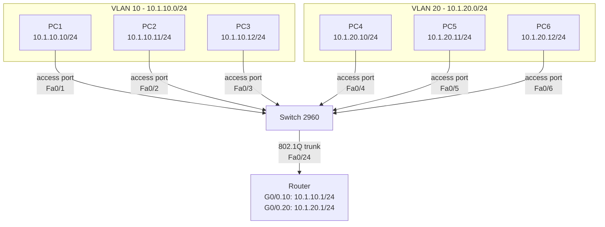
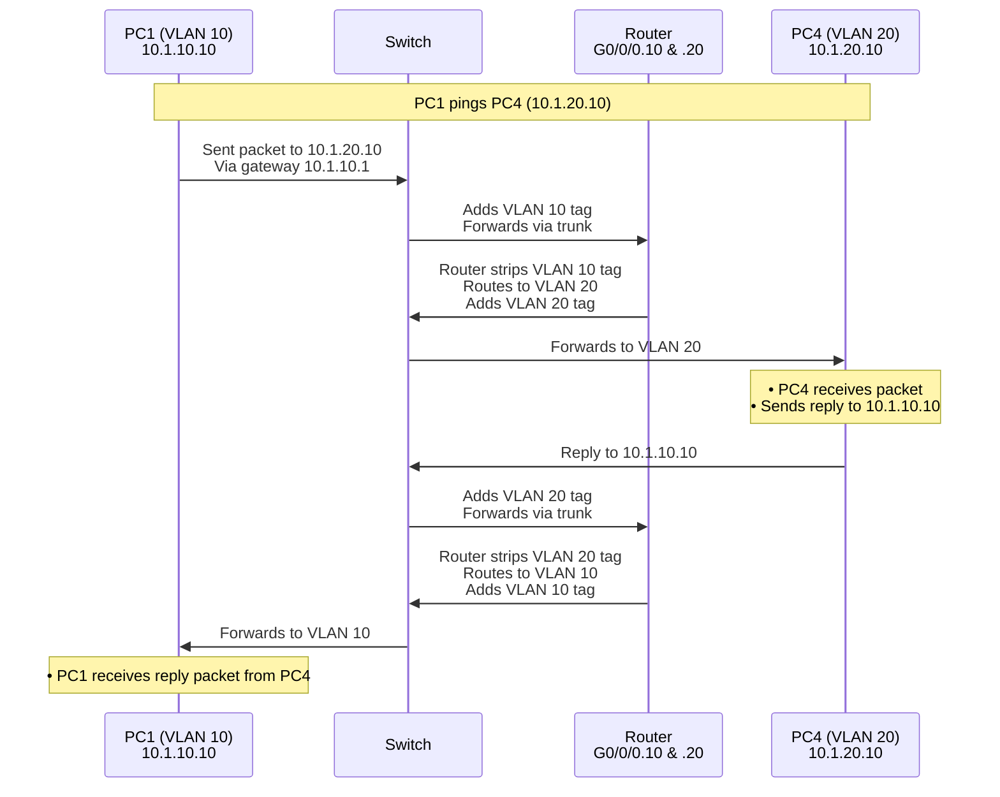
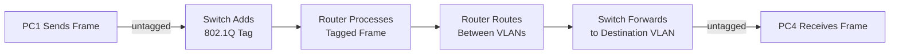

# **Project 5: Router-on-a-Stick Inter-VLAN Routing**

**Time Estimate:** 40 minutes | **Difficulty:** Beginner-Intermediate | **Status:** Tested ✓ | **Last Updated:** 2025-10-5

## **Table of Contents**
- [Objective](#objective)
- [Quick Start](#quick-start)
- [Topology & Design](#topology--design)
- [Configuration](#configuration)
- [Verification](#verification)
- [Troubleshooting](#troubleshooting)
- [Protocol Deep Dive](#protocol-deep-dive)
- [Skills Demonstrated](#skills-demonstrated)
- [Real-World Applications](#real-world-applications)
- [Learning Outcomes](#learning-outcomes)

## **Objective**
> Enable communication between isolated VLANs using a single router interface through the Router-on-a-Stick method, demonstrating inter-VLAN routing principles and trunking protocols.

**Key Goals:**
- [ ] Configure trunk port between switch and router
- [ ] Create router sub-interfaces for each VLAN
- [ ] Implement 802.1Q encapsulation
- [ ] Establish inter-VLAN communication
- [ ] Verify end-to-end connectivity

## **Quick Start**
### **Prerequisites**
- Completion of Project 4 (Basic VLAN Configuration)
- Understanding of VLAN concepts and IP routing
- Packet Tracer with router and 2960 switch

### **Implementation Checklist**
- [ ] Configure switch trunk port (10 minutes)
- [ ] Create router sub-interfaces (15 minutes)
- [ ] Update PC gateway settings (5 minutes)
- [ ] Test inter-VLAN routing (10 minutes)

### **Time Breakdown**
| Phase | Time | Focus |
|-------|------|-------|
| Trunk Config | 10 min | Switch-to-router connection |
| Router Config | 15 min | Sub-interface setup |
| PC Updates | 5 min | Gateway configuration |
| Verification | 10 min | Cross-VLAN testing |

## **Topology & Design**

### **Physical vs Logical View**


### **Packet Flow Visualization**


### **Network Design Table**
| Component | Specification | Purpose |
|-----------|---------------|---------|
| VLAN 10 | 10.1.10.0/24 | Sales Department |
| VLAN 20 | 10.1.20.0/24 | HR Department |
| Router G0/0.10 | 10.1.10.1/24 | VLAN 10 Gateway |
| Router G0/0.20 | 10.1.20.1/24 | VLAN 20 Gateway |
| Trunk Port | Switch Fa0/24 | Carries multiple VLANs |

### **The WHY**
- **Why Router-on-a-Stick?** Cost-effective inter-VLAN routing with single interface
- **Why sub-interfaces?** Logical separation of VLAN routing on physical interface
- **Why trunk link?** Carries multiple VLAN traffic between switch and router
- **Why 802.1Q?** Standard protocol for VLAN tagging on trunk links

## **Configuration**

### **Switch Trunk Configuration**
```bash
Switch> enable
Switch# configure terminal

! Configure trunk port to router
Switch(config)# interface fastethernet 0/24
Switch(config-if)# switchport mode trunk
Switch(config-if)# switchport trunk native vlan 99
Switch(config-if)# switchport trunk allowed vlan 10,20
Switch(config-if)# description Trunk to Router G0/0
Switch(config-if)# no shutdown
Switch(config-if)# exit

Switch(config)# end
Switch# copy running-config startup-config
```

### **Router Sub-interface Configuration**
```bash
Router> enable
Router# configure terminal

! Enable physical interface first
Router(config)# interface gigabitethernet 0/0/0
Router(config-if)# description Trunk to Switch Fa0/24
Router(config-if)# no shutdown
Router(config-if)# exit

! Configure sub-interface for VLAN 10
Router(config)# interface gigabitethernet 0/0.10
Router(config-subif)# description VLAN 10 - Sales Department
Router(config-subif)# encapsulation dot1Q 10
Router(config-subif)# ip address 10.1.10.1 255.255.255.0
Router(config-subif)# exit

! Configure sub-interface for VLAN 20
Router(config)# interface gigabitethernet 0/0.20
Router(config-subif)# description VLAN 20 - HR Department
Router(config-subif)# encapsulation dot1Q 20
Router(config-subif)# ip address 10.1.20.1 255.255.255.0
Router(config-subif)# exit

Router(config)# end
Router# copy running-config startup-config
```

### **PC Gateway Configuration**
```bash
# VLAN 10 PCs (Sales):
PC1: 10.1.10.10/24 | Gateway: 10.1.10.1
PC2: 10.1.10.11/24 | Gateway: 10.1.10.1
PC3: 10.1.10.12/24 | Gateway: 10.1.10.1

# VLAN 20 PCs (HR):
PC4: 10.1.20.10/24 | Gateway: 10.1.20.1
PC5: 10.1.20.11/24 | Gateway: 10.1.20.1
PC6: 10.1.20.12/24 | Gateway: 10.1.20.1
```

### **The WHY**
- **Why native VLAN 99?** Security best practice (avoid using default VLAN 1)
- **Why allowed VLAN list?** Restricts trunk to only necessary VLANs
- **Why encapsulation?** Binds sub-interface to specific VLAN ID
- **Why gateway configuration?** Tells PCs how to reach other networks

## **Verification**

### **Expected Results**
```bash
# Switch trunk verification:
Switch# show interfaces trunk
Port        Mode             Encapsulation  Status        Native vlan
Fa0/24      on               802.1q         trunking      99

Port        Vlans allowed on trunk
Fa0/24      10,20

# Router sub-interface status:
Router# show ip interface brief
Interface                  IP-Address      OK? Method Status
GigabitEthernet0/0       unassigned      YES manual up
GigabitEthernet0/0.10    10.1.10.1       YES manual up
GigabitEthernet0/0.20    10.1.20.1       YES manual up

# Successful inter-VLAN ping:
C:\> ping 10.1.20.10
Reply from 10.1.20.10: bytes=32 time=2ms TTL=127
```

### **Verification Steps**
1. **Trunk Status:** `show interfaces trunk` confirms trunk operational
2. **Sub-interface Status:** `show ip interface brief` shows all sub-interfaces up
3. **Routing Table:** `show ip route` displays connected VLAN networks
4. **Intra-VLAN Test:** Ping within same VLAN (PC1 → PC2)
5. **Inter-VLAN Test:** Ping across VLANs (PC1 → PC4)
6. **Bidirectional Test:** Verify communication works both directions

### **The WHY**
- **Why check trunk status?** Confirms VLAN tagging is operational
- **Why verify sub-interfaces?** Ensures router can route between VLANs
- **Why bidirectional testing?** Confirms routing works in both directions

## **Troubleshooting**

### **Common Issues & Solutions**
| Symptom | Possible Cause | Solution |
|---------|---------------|----------|
| Inter-VLAN ping fails | Trunk not configured | Verify `show interfaces trunk` |
| Sub-interface down | Encapsulation mismatch | Check VLAN IDs match on both ends |
| One-way communication | Incorrect gateway | Verify PC gateway settings |
| Native VLAN issues | Mismatched native VLAN | Set consistent native VLAN |

### **Debug Commands**
```bash
# Switch troubleshooting:
show interfaces trunk
show interfaces fa0/24 switchport
show vlan brief

# Router troubleshooting:
show ip interface brief
show vlans
show running-config interface gigabitethernet0/0/0.10
debug ip packet (use cautiously)
```

## **Protocol Deep Dive**

### **802.1Q Tagging Process**


### **Key Concepts**
- **802.1Q Tag:** 4-byte field inserted into Ethernet frame with VLAN ID
- **Native VLAN:** Untagged traffic on trunk (security consideration)
- **Sub-interface:** Logical interface bound to specific VLAN
- **Routing Decision:** Router makes layer 3 decision based on IP, not VLAN

### **Frame Transformation**
```
PC1 to Switch (Access Port):
[Ethernet Header][IP Packet][Data]

Switch to Router (Trunk Port):
[Ethernet Header][802.1Q Tag][IP Packet][Data]
          ↑
      VLAN 10 Tag

Router to Switch (Trunk Port):
[Ethernet Header][802.1Q Tag][IP Packet][Data]
          ↑
      VLAN 20 Tag

Switch to PC4 (Access Port):
[Ethernet Header][IP Packet][Data]
```

## **Skills Demonstrated**
- ✅ **Trunk Configuration** - Setting up VLAN trunk links
- ✅ **Sub-interface Setup** - Creating logical router interfaces
- ✅ **802.1Q Encapsulation** - Understanding VLAN tagging
- ✅ **Inter-VLAN Routing** - Enabling communication between VLANs
- ✅ **End-to-End Testing** - Verifying complete communication path

## **Real-World Applications**

### **Enterprise Network Design**
- **Departmental Routing** - Controlled communication between departments
- **Multi-Tenant Environments** - Separate customers with shared infrastructure
- **Security Zones** - Controlled access between different security levels
- **Cost Optimization** - Efficient use of router interfaces

### **Business Value**
- **Controlled Access** - Managed communication between network segments
- **Cost Efficiency** - Reduced hardware requirements for inter-VLAN routing
- **Security** - Granular control over cross-department communication
- **Scalability** - Easy to add more VLANs with additional sub-interfaces

## **Learning Outcomes**
By completing this lab, you will understand:

### **Technical Knowledge**
- How Router-on-a-Stick enables inter-VLAN communication
- 802.1Q trunking protocol and VLAN tagging process
- Router sub-interface concepts and configuration
- The complete packet journey across VLAN boundaries

### **Practical Skills**
- Configuring and troubleshooting trunk links
- Setting up router sub-interfaces for VLAN routing
- Using verification commands for inter-VLAN routing
- Diagnosing common trunk and routing issues

### **Career Foundation**
- **Prepares for:** Layer 3 switching concepts
- **Builds toward:** Advanced routing protocols in multi-VLAN environments
- **Essential for:** Network engineer roles requiring VLAN expertise
- **Interview ready:** Common topic in networking technical interviews

---

**Maintained by:** Rick's Home Lab 

*Part of the CCNA Fundamentals Series - Advanced Layer 2/Layer 3 Integration*

