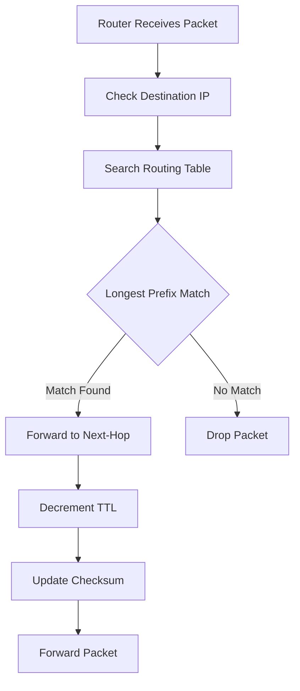

# **Project 6: Basic Static Routing**

**Time Estimate:** 45 minutes | **Difficulty:** Beginner-Intermediate | **Status:** Tested ✓ | **Last Updated:** 2024-12-19

## **Table of Contents**
- [Objective](#objective)
- [Quick Start](#quick-start)
- [Topology & Design](#topology--design)
- [Configuration](#configuration)
- [Verification](#verification)
- [Troubleshooting](#troubleshooting)
- [Protocol Deep Dive](#protocol-deep-dive)
- [Skills Demonstrated](#skills-demonstrated)
- [Real-World Applications](#real-world-applications)
- [Learning Outcomes](#learning-outcomes)

## **Objective**
> Connect three separate networks using static routing to understand manual route configuration, multi-hop packet forwarding, and routing table management in multi-router environments.

**Key Goals:**
- [ ] Configure router interfaces for multiple networks
- [ ] Implement static routes for remote network reachability
- [ ] Establish end-to-end communication across routers
- [ ] Understand routing table population and packet forwarding

## **Quick Start**
### **Prerequisites**
- Completion of Project 3 (Basic router configuration)
- Understanding of IP addressing and subnetting
- Packet Tracer with multiple routers

### **Implementation Checklist**
- [ ] Configure Router1 interfaces and static route (15 minutes)
- [ ] Configure Router2 interfaces and static route (15 minutes)
- [ ] Set up PC IP addresses and gateways (5 minutes)
- [ ] Test multi-hop connectivity (10 minutes)

### **Time Breakdown**
| Phase | Time | Focus |
|-------|------|-------|
| Router1 Config | 15 min | Interfaces + static route |
| Router2 Config | 15 min | Interfaces + static route |
| PC Setup | 5 min | IP and gateway configuration |
| Verification | 10 min | Cross-network testing |

## **Topology & Design**

### **Network Architecture**
```
Network A (192.168.1.0/24)     Network B (10.0.0.0/30)     Network C (192.168.2.0/24)
        │                               │                             │
      [PC1] ────────────────────── [Router1] ─────────────────── [Router2] ─────────────────── [PC2]
  192.168.1.10/24          G0/0/0    │    G0/0/1        G0/0/0    │    G0/0/1          192.168.2.10/24
                           192.168.1.1 │  10.0.0.1      10.0.0.2   │  192.168.2.1
                                        │                           │
                                  Gateway for PC1             Gateway for PC2
```

### **Packet Flow Visualization**
```
PC1 (Network A)                Router1                  Router2                 PC2 (Network C)
192.168.1.10             G0/0/0     G0/0/1        G0/0/0     G0/0/1         192.168.2.10
     │                      │           │            │           │                 │
     │  PC1 pings PC2       │           │            │           │                 │
     │  (192.168.2.10)      │           │            │           │                 │
     │                      │           │            │           │                 │
     │ • Packet to 192.168.2.10 │           │            │           │                 │
     │ • Via gateway 192.168.1.1│           │            │           │                 │
     │                      │           │            │           │                 │
     │──────────────────────>│           │            │           │                 │
     │                      │           │            │           │                 │
     │                      │ • Checks routing table │           │                 │
     │                      │ • Static route: 192.168.2.0/24 via 10.0.0.2 │           │                 │
     │                      │           │            │           │                 │
     │                      │─────────────────────────>│           │                 │
     │                      │           │            │           │                 │
     │                      │           │            │ • Checks routing table │                 │
     │                      │           │            │ • Connected: 192.168.2.0/24 │                 │
     │                      │           │            │           │                 │
     │                      │           │            │─────────────────────────────>│
     │                      │           │            │           │                 │
     │                      │           │            │           │                 │ • PC2 receives packet
     │                      │           │            │           │                 │ • Sends reply to 192.168.1.10
     │                      │           │            │           │                 │
     │  (Reverse process with static route on Router2)  │                 │
     │<──────────────────────│           │            │           │                 │
```

### **Network Design Table**
| Network | Subnet | Purpose | Devices |
|---------|--------|---------|---------|
| Network A | 192.168.1.0/24 | LAN 1 | PC1, Router1 G0/0/0 |
| Network B | 10.0.0.0/30 | WAN Link | Router1 G0/0/1, Router2 G0/0/0 |
| Network C | 192.168.2.0/24 | LAN 2 | PC2, Router2 G0/0/1 |

### **The WHY**
- **Why /30 for WAN link?** Efficient use of IP space for point-to-point connections
- **Why static routing?** Demonstrates manual route configuration fundamentals
- **Why multiple routers?** Shows real-world multi-hop network scenarios
- **Why specific IP ranges?** Standard private addressing conventions

## **Configuration**

### **Router1 Configuration**
```bash
Router1> enable
Router1# configure terminal

! Configure LAN interface (Network A)
Router1(config)# interface gigabitethernet 0/0/0
Router1(config-if)# description LAN Connection to Network A
Router1(config-if)# ip address 192.168.1.1 255.255.255.0
Router1(config-if)# no shutdown
Router1(config-if)# exit

! Configure WAN interface (Network B)
Router1(config)# interface gigabitethernet 0/0/1
Router1(config-if)# description WAN Link to Router2
Router1(config-if)# ip address 10.0.0.1 255.255.255.252
Router1(config-if)# no shutdown
Router1(config-if)# exit

! Add static route to Network C via Router2
Router1(config)# ip route 192.168.2.0 255.255.255.0 10.0.0.2
Router1(config)# end
Router1# copy running-config startup-config
```

### **Router2 Configuration**
```bash
Router2> enable
Router2# configure terminal

! Configure WAN interface (Network B)
Router2(config)# interface gigabitethernet 0/0/0
Router2(config-if)# description WAN Link to Router1
Router2(config-if)# ip address 10.0.0.2 255.255.255.252
Router2(config-if)# no shutdown
Router2(config-if)# exit

! Configure LAN interface (Network C)
Router2(config)# interface gigabitethernet 0/0/1
Router2(config-if)# description LAN Connection to Network C
Router2(config-if)# ip address 192.168.2.1 255.255.255.0
Router2(config-if)# no shutdown
Router2(config-if)# exit

! Add static route to Network A via Router1
Router2(config)# ip route 192.168.1.0 255.255.255.0 10.0.0.1
Router2(config)# end
Router2# copy running-config startup-config
```

### **PC Configurations**
```bash
# Network A - PC1:
IP Address: 192.168.1.10/24
Default Gateway: 192.168.1.1

# Network C - PC2:
IP Address: 192.168.2.10/24  
Default Gateway: 192.168.2.1
```

### **The WHY**
- **Why /30 mask?** Provides exactly 2 usable IPs for point-to-point link
- **Why static route syntax?** `ip route [network] [mask] [next-hop]`
- **Why next-hop IP?** Tells router where to forward packets for remote network
- **Why save configuration?** Prevents route loss after router reboot

## **Verification**

### **Expected Results**
```bash
# Router1 routing table:
Router1# show ip route
Codes: C - connected, S - static, I - IGRP, R - RIP...
C    192.168.1.0/24 is directly connected, GigabitEthernet0/0/0
C    10.0.0.0/30 is directly connected, GigabitEthernet0/0/1
S    192.168.2.0/24 [1/0] via 10.0.0.2

# Successful end-to-end ping:
C:\> ping 192.168.2.10
Reply from 192.168.2.10: bytes=32 time=4ms TTL=126

# Traceroute shows path:
C:\> tracert 192.168.2.10
Tracing route to 192.168.2.10 over a maximum of 30 hops:
  1   1 ms    1 ms    1 ms    192.168.1.1
  2   2 ms    2 ms    2 ms    10.0.0.2
  3   3 ms    2 ms    2 ms    192.168.2.10
```

### **Verification Steps**
1. **Interface Status:** `show ip interface brief` on both routers
2. **Routing Tables:** `show ip route` to verify static routes
3. **Direct Connectivity:** Ping between router interfaces
4. **End-to-End Test:** Ping from PC1 to PC2 and vice versa
5. **Path Verification:** Traceroute to confirm packet path

### **The WHY**
- **Why check routing tables?** Confirms routers know how to reach remote networks
- **Why traceroute?** Visualizes the actual path packets take
- **Why bidirectional testing?** Ensures routing works in both directions
- **Why TTL analysis?** Shows number of hops (decreases by 1 per router)

## **Troubleshooting**

### **Common Issues & Solutions**
| Symptom | Possible Cause | Solution |
|---------|---------------|----------|
| Ping fails between networks | Missing static route | Verify `show ip route` on both routers |
| One-way communication | Asymmetric routing | Check static routes in both directions |
| Router can't ping next-hop | Interface down | Verify `no shutdown` and physical connections |
| TTL expired in transit | Routing loop | Check for circular static routes |

### **Debug Commands**
```bash
# Router troubleshooting:
show ip route
show ip interface brief
ping 10.0.0.2 (test next-hop reachability)
traceroute 192.168.2.10
show running-config | include ip route

# PC troubleshooting:
ipconfig /all
ping 192.168.1.1 (test gateway)
tracert 192.168.2.10
```

## **Protocol Deep Dive**

### **Routing Decision Process**


### **Key Concepts**
- **Longest Prefix Match:** Router chooses most specific route available
- **Administrative Distance:** Static routes have AD of 1 (highly trusted)
- **TTL Mechanism:** Prevents infinite loops in routing
- **Recursive Lookup:** Router may need multiple table lookups for final forwarding

### **Static Route Components**
```
ip route [destination_network] [subnet_mask] [next_hop]
    │               │               │           │
    Command         Network         Mask      Next Router
    to add          to reach        for        IP Address
    static route                  network
```

## **Skills Demonstrated**
- ✅ **Static Route Configuration** - Manual routing table population
- ✅ **Multi-Router Design** - Network segmentation and connectivity
- ✅ **Routing Table Analysis** - Interpreting and verifying routes
- ✅ **End-to-End Troubleshooting** - Diagnosing multi-hop issues
- ✅ **Network Path Analysis** - Using traceroute for path verification

## **Real-World Applications**

### **Enterprise Network Scenarios**
- **Branch Office Connectivity** - Connecting remote sites to headquarters
- **Network Segmentation** - Controlled routing between departments
- **DMZ Networks** - Specific routing for security zones
- **Backup Links** - Manual failover paths for redundancy

### **Business Value**
- **Predictable Routing** - Complete control over network paths
- **Security** - No routing protocol vulnerabilities
- **Resource Efficiency** - Lower CPU and bandwidth usage
- **Cost Effective** - Suitable for small to medium networks

## **Learning Outcomes**
By completing this lab, you will understand:

### **Technical Knowledge**
- How routers make forwarding decisions using routing tables
- Static vs dynamic routing trade-offs
- Multi-hop packet forwarding principles
- Routing table structure and interpretation

### **Practical Skills**
- Configuring and verifying static routes
- Troubleshooting end-to-end connectivity issues
- Analyzing network paths using traceroute
- Managing routing in multi-router environments

### **Career Foundation**
- **Prepares for:** Dynamic routing protocols (OSPF, EIGRP)
- **Builds toward:** Complex enterprise network designs
- **Essential for:** Network administrator and engineer roles
- **Interview ready:** Fundamental networking concept

---

**Maintained by:** Rick's Home Lab  
*Part of the CCNA Fundamentals Series - Mastering Routing Concepts*

## **Career Connection:**
Static routing is a fundamental concept that appears in virtually all networking interviews. This project demonstrates you understand not just how to configure routes, but how packets actually move through multi-router networks. The ability to interpret routing tables and use traceroute for troubleshooting are essential skills for network troubleshooting roles.
